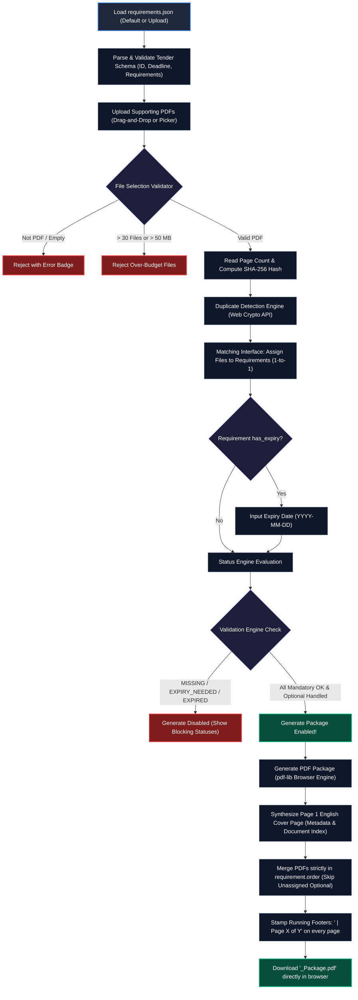

# Tender Document Package Builder

### AI DevFest 2026 — AI Vibe-Coding Contest Submission

---

## 👤 Participant Information

- **Name:** Riyadus Salehin
- **Registration Number:** `cmtvjii5700nddxknobf7lq6`
- **Project Name:** Tender Document Package Builder
- **Live Application URL:** [https://devfest-cmtvjii5700nddxknobf7lq6f.vercel.app/](https://devfest-cmtvjii5700nddxknobf7lq6f.vercel.app/)

---

## 📖 Project Overview & Explanation

### The Problem It Solves
In public procurement and corporate tenders, bidders are required to assemble extensive portfolios of legal, financial, and technical documents (e.g., Trade Licenses, TIN/VAT certificates, Bank Solvency, Audited Financials, Technical Proposals). Procurement entities enforce rigid submission rules:
1. **Zero tolerance for missing mandatory documents** — failure to submit any required certificate results in immediate disqualification.
2. **Strict certificate validity** — documents with expiration dates (like trade licenses or bank solvency letters) must remain valid on or beyond the official submission deadline.
3. **Rigid package structure** — submissions must follow a predefined requirement order, include a formal cover page summarizing the tender metadata and included documents, and feature continuous page numbering (`<tender_id> | Page X of Y`) across every sheet.
4. **Data privacy & confidentiality** — tender packages contain highly sensitive financial, commercial, and technical proposals that cannot be exposed to third-party cloud servers.

### The Solution: Privacy-First Client-Side Package Builder
The **Tender Document Package Builder** solves this challenge through a completely browser-side, privacy-preserving workflow. The application reads tender manifests (`requirements.json`), validates user-uploaded PDFs, identifies content-identical duplicate files using SHA-256 cryptographic hashing, enforces 1-to-1 requirement matching, validates document expiration dates against the tender deadline in real time, and synthesizes a fully merged, audit-ready PDF package complete with an English cover page and running footers.

**Key Architecture Principle:** No files, credentials, or document bytes are ever uploaded to any server. Everything executes locally in the user's browser runtime using the Web Crypto API and `pdf-lib`.

---

## 🔄 End-to-End Workflow Diagram



---

## 🗂️ Project File Structure

```text
my-app/
├── app/                                 # Next.js 16 App Router
│   ├── globals.css                      # Global styles & Tailwind CSS configuration
│   ├── layout.tsx                       # Root HTML layout with responsive meta tags
│   └── page.tsx                         # Client-side root page container
│
├── components/                          # Modular Office UI Components
│   ├── Header.tsx                       # App header, title, and EN / বাং language switcher
│   ├── TenderInfoBanner.tsx             # Tender ID, title, procuring entity, bidder, deadline
│   ├── UploadSection.tsx                # Drag-and-drop dropzone, 30-file / 50MB budget gauges
│   ├── MatchingSection.tsx              # 1-to-1 document matching list, status chips, expiry picker
│   ├── ValidationSummary.tsx            # Real-time counter metrics (OK, Missing, Expired, etc.)
│   └── GenerateSection.tsx              # Package generation trigger, progress, and download action
│
├── hooks/                               # Custom React State & Lifecycle Hooks
│   ├── useJsonFilePicker.ts             # Custom requirements.json file selection and parsing
│   ├── useRequirementMatches.ts         # Bi-directional 1-to-1 matching state & unmatching logic
│   ├── useTenderRequirements.ts         # Tender metadata & requirement manifest lifecycle
│   └── useUploadedDocuments.ts          # PDF uploads, removal, hash calculation & duplicate detection
│
├── i18n/                                # Bilingual Localization System
│   ├── context.tsx                      # React Language Context & useTranslation hook
│   ├── en.ts                            # English translation dictionary
│   ├── bn.ts                            # Bangla translation dictionary
│   └── index.ts                         # Public i18n exports
│
├── lib/                                 # Core Business Logic & Engine Modules
│   ├── constants.ts                     # Upload limits (30 files, 50 MB, 1 MB JSON limit)
│   ├── crypto/
│   │   ├── hash.ts                      # Browser Web Crypto SHA-256 hashing (computeSha256)
│   │   └── index.ts                     # Public crypto exports
│   ├── pdf/
│   │   ├── coverPage.ts                 # Clean English A4 cover page builder with document index
│   │   ├── footers.ts                   # Running footer stamper: "<tender_id> | Page X of Y"
│   │   ├── generatePackage.ts           # End-to-end PDF merge & package compiler
│   │   ├── readPdf.ts                   # Client-side PDF page counter and metadata reader
│   │   └── index.ts                     # Public PDF exports
│   ├── requirements/
│   │   ├── parse.ts                     # BOM-safe JSON text parser and file reader
│   │   ├── stats.ts                     # Requirement count statistics (mandatory/optional)
│   │   ├── validate.ts                  # Schema and date validator (validateRequirementsData)
│   │   └── index.ts                     # Public requirements exports
│   ├── upload/
│   │   ├── duplicates.ts                # Content-hash based duplicate detection (markDuplicateDocuments)
│   │   ├── validateSelection.ts         # Slot (30 files) and storage (50 MB) budget validator
│   │   └── index.ts                     # Public upload exports
│   └── validation/
│       ├── statusEngine.ts              # Requirement evaluation engine (MISSING, EXPIRED, OK, etc.)
│       └── index.ts                     # Public validation exports
│
├── public/
│   ├── requirements.json                # Sample/default tender requirements manifest
│   └── favicon.ico                      # Application icon
│
├── types/                               # TypeScript Definitions
│   ├── document.ts                      # UploadedDocument, FileRejection, SelectionLimits
│   ├── i18n.ts                          # Language, TranslationDictionary types
│   ├── tender.ts                        # TenderInfo, Requirement, RequirementsData
│   ├── validation.ts                    # RequirementStatus, ValidationSummary
│   └── index.ts                         # Public type re-exports
│
├── utils/
│   ├── format.ts                        # File size formatter, date formatter, Bengali numeral conversion
│   └── index.ts                         # Public utility exports
│
├── README.md                            # Comprehensive project documentation
├── package.json                         # Project dependencies and npm scripts
├── tsconfig.json                        # TypeScript compiler configuration
└── next.config.ts                       # Next.js configuration
```

---

## 🌐 Live URL

🔗 **Production Deployment:** [https://devfest-cmtvjii5700nddxknobf7lq6f.vercel.app/](https://devfest-cmtvjii5700nddxknobf7lq6f.vercel.app/)

---

## ✨ Main Features

1. **Structured Requirements Loading & Validation**
   - Automatically loads the default tender manifest (`public/requirements.json`) or allows uploading custom JSON manifests.
   - Robust parsing: strips UTF-8 BOM, validates required fields, dates, and requirement structures.

2. **Client-Side PDF Upload & Limits Enforcement**
   - Multi-file drag-and-drop and file browser picker.
   - Strictly enforces a **30-file limit** and a **50 MB total size limit**.
   - Automatic rejection of non-PDF files (e.g. PNG, JPEG) and empty files with clear user feedback.
   - Instant client-side page counting and file size display.

3. **Content-Based Duplicate Detection**
   - Employs **SHA-256 cryptographic hashing via the Web Crypto API** on actual file contents.
   - Detects identical files even if they have different filenames (e.g. `experience_cert.pdf` vs `experience_cert (1).pdf`).
   - Marks duplicate files with warning badges and prevents duplicate files from being matched to different requirements.

4. **Document-to-Requirement Matching**
   - Office-friendly 1-to-1 matching interface.
   - Flexible controls to assign, swap, or unmatch documents.
   - Displays matched document name and page count beside each requirement.

5. **Real-Time Requirement Status Engine**
   - Immediate status evaluation for each requirement:
     - `MISSING`: Mandatory requirement with no document attached.
     - `NOT_PROVIDED`: Optional requirement with no document attached (non-blocking).
     - `EXPIRY_NEEDED`: Document attached to expiring requirement but expiry date is missing.
     - `EXPIRED`: Document expiry date is strictly before the tender submission deadline.
     - `OK`: Valid document attached (non-expiring, or expiry $\ge$ submission deadline).
   - Validation summary cards showing counts for each status.
   - Generate button is automatically disabled when any blocking status (`MISSING`, `EXPIRY_NEEDED`, `EXPIRED`) exists.

6. **Consolidated PDF Package Generation**
   - **Page 1 English Cover Page**: Clean A4 layout containing Tender ID, Title, Procuring Entity, Bidder, Submission Deadline, Package Creation Date, and an Included Documents table.
   - **Strict Document Ordering**: Appends matched PDFs strictly by `requirement.order`.
   - **Full Page Preservation**: Preserves 100% of pages and internal layout from source PDFs.
   - **Optional Exclusion**: Skips unassigned optional requirements cleanly.

7. **Unified Running Footers & Page Numbering**
   - Inscribes `<tender_id> | Page X of Y` on every page (including the cover page).
   - Total page count $Y$ reflects the exact final package page count.
   - Positioned in bottom margins to prevent overlapping document content.
   - Final download named strictly as `<tender_id>_Package.pdf` (e.g. `T-2026-0417_Package.pdf`).

8. **Complete Bilingual Support (English & Bangla)**
   - Single-click language switcher (`EN` / `বাং`).
   - Centralized translations for navigation, badges, error messages, and buttons.
   - Displays `title_en` in English mode and `title_bn` in Bangla mode.
   - Localized Bengali numerals and dates in Bangla mode.

9. **Unseen-Data Resilient**
   - Fully dynamic logic tested against arbitrary tender IDs, arbitrary requirement counts, non-standard order numbers, and custom deadlines.

---

## 🎁 Bonus Features Completed

- **Web Crypto SHA-256 Hashing**: Content-level duplicate detection without server-side computation.
- **Comprehensive Bilingual UI (English & Bangla)**: Dynamic switching with native Bengali numeral conversion.
- **Drag-and-Drop File Upload Zone**: Visual drag states and live capacity indicators for file count and total storage.
- **Custom Requirements Uploader**: Ability to load arbitrary `requirements.json` files on the fly.
- **Zero Server Footprint**: Complete client-side execution ensuring corporate and government document confidentiality.

---

## 🛠️ Technology Stack

- **Framework:** Next.js 16 (App Router, Turbopack)
- **UI Library:** React 19
- **Programming Language:** TypeScript 5
- **Styling:** Tailwind CSS v4
- **PDF Manipulation:** `pdf-lib` (pure client-side PDF document manipulation)
- **Cryptography:** Web Crypto API (`crypto.subtle.digest`)
- **Deployment Platform:** Vercel

---

## 🚀 How to Run Locally

### Prerequisites
- Node.js 18+ (Node.js 20+ recommended)
- npm or pnpm

### 1. Clone the repository
```bash
git clone https://github.com/riyad899/devfest--cmtvjii5700nddxknobf7lq6f-.git
cd devfest--cmtvjii5700nddxknobf7lq6f-/my-app
```

### 2. Install dependencies
```bash
npm install
```

### 3. Run development server
```bash
npm run dev
```

Open [http://localhost:3000](http://localhost:3000) in your browser.

---

## 🏗️ How to Build for Production

```bash
npm run build
npm run start
```

---

## 🤖 AI Tools Used

- **Google Antigravity IDE**: Advanced Agentic Pair Programming & Workflow Orchestration.

---

## 💡 Most Useful AI Prompts

1. *"Implement browser-side content-based duplicate PDF detection using the Web Crypto API SHA-256 hashing, ensuring file names are not used for comparison."*
2. *"Implement the complete requirement status engine with strict rules: mandatory vs optional, expiry comparison with deadline, and real-time validation summary."*
3. *"Generate an audit-compliant English cover page with A4 dimensions and merge matched PDFs in requirement.order preserving all original pages without uploading files to a server."*
4. *"Update PDF generation to stamp `<tender_id> | Page X of Y` on every page including the cover page, ensuring footers never truncate content."*
5. *"Create centralized translation dictionaries for English and Bangla, ensuring seamless bilingual switching without duplicating business logic."*

---

## ⚠️ Known Issues

- **None**: All 30 functional audit criteria pass cleanly. Zero linter warnings, zero TypeScript errors, and zero production build issues.